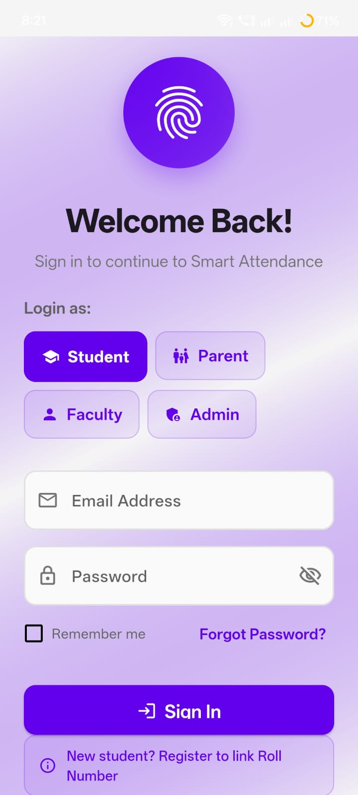
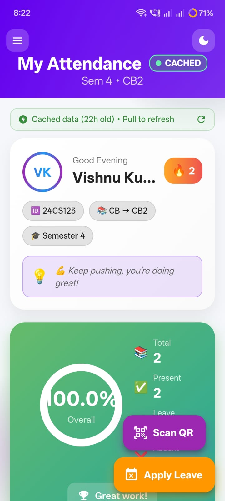
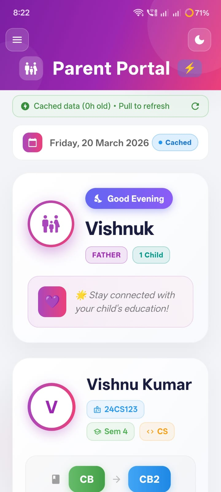
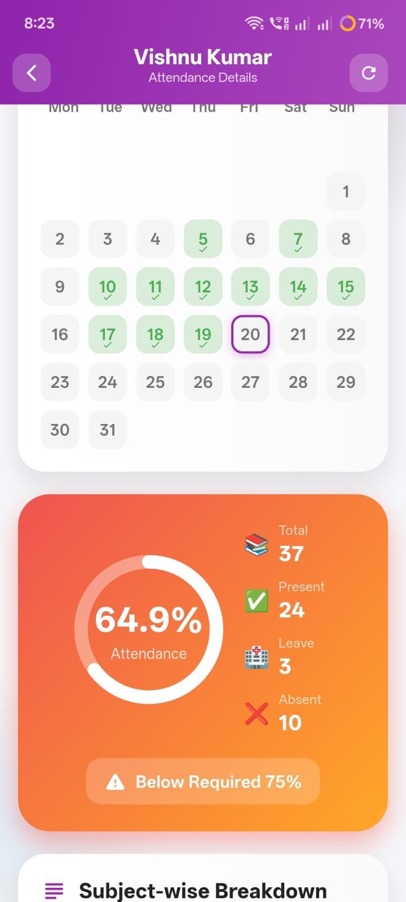
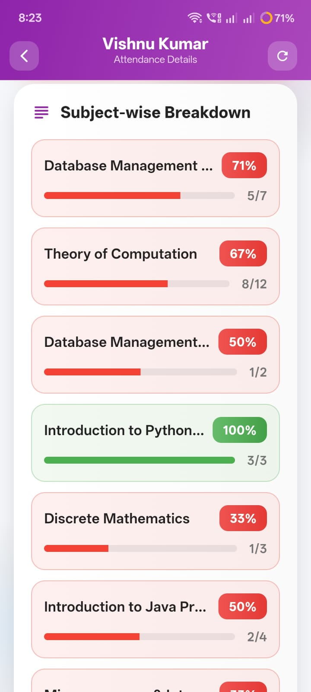
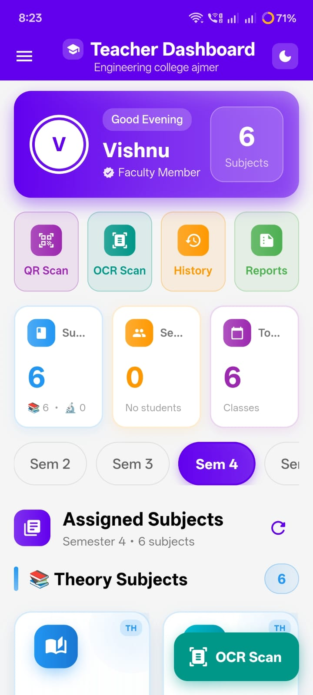
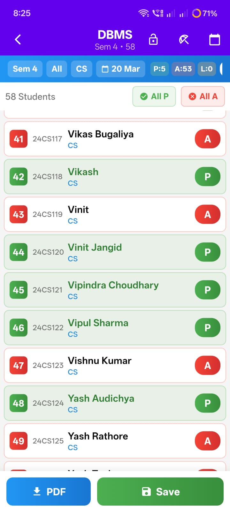
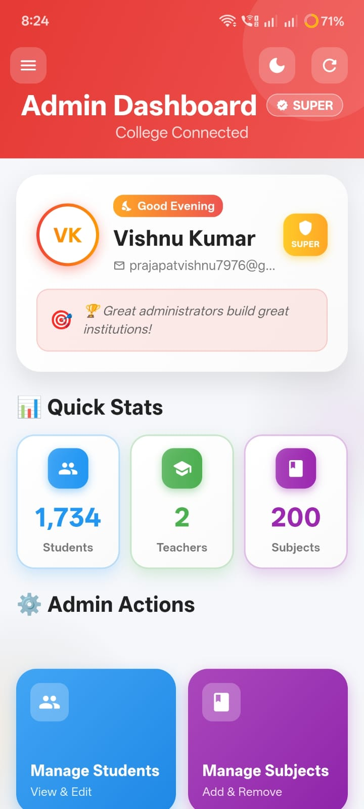
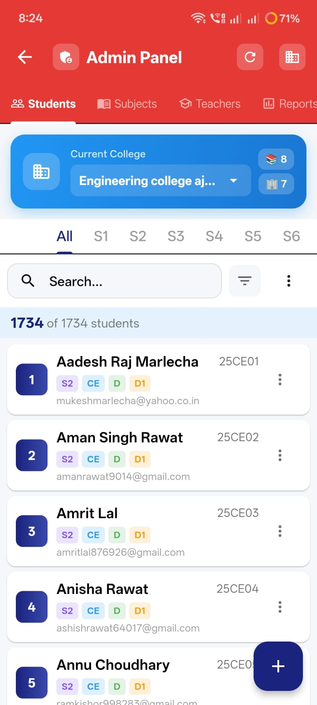

# 📊 Smart Attendance System 🚀

An AI-powered smart attendance system designed to automate and streamline attendance tracking in educational institutions.
This system ensures accurate, real-time attendance management with a scalable backend.

---

## ✨ Features

* 📱 Real-time attendance tracking
* 👨‍🏫 Admin dashboard for managing students & classes
* 📊 Attendance reports and analytics
* 🔐 Secure authentication system
* ☁️ Firebase backend integration
* ⚡ Fast and optimized performance

---

## 🛠️ Tech Stack

* **Frontend:** Flutter
* **Backend:** Firebase
* **Database:** Firestore
* **Authentication:** Firebase Auth

---

## 📸 Screenshots

  
  
  

  
  
  

  
  
  

---

## 🚀 Project Highlights

* Built for real-world college attendance systems
* Handles multiple users efficiently
* Designed with scalability in mind
* Clean UI/UX for better usability

---

## 🔐 Note

The full source code of this project is kept private due to security and API restrictions.
This repository is intended to showcase the project features, UI, and overall functionality.

--

## 📫 Connect With Me

* 💼 LinkedIn: https://www.linkedin.com/in/vishnu-kumar-545037327/
* 🌐 Portfolio: https://prajapatvishnu7976-sys.github.io/My-portfolio/

---

⭐ **"Code. Build. Learn. Repeat."**
